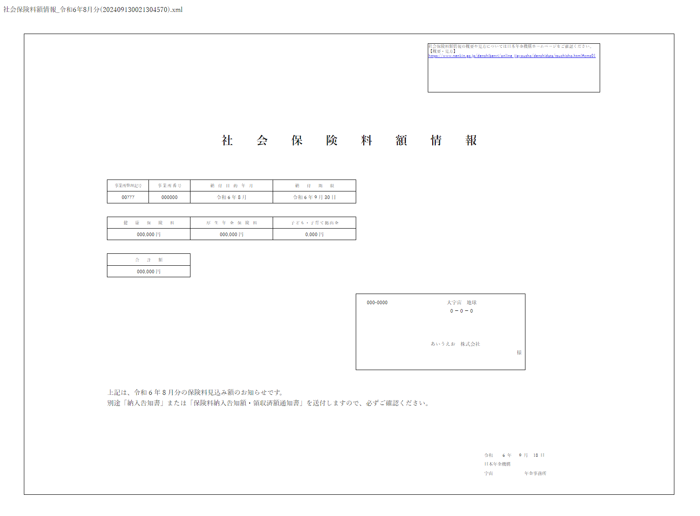

# xsl-viewer-html

HTML ファイルひとつで、電子公文書が入った XLS ファイル入りの ZIP ファイルを展開し表示します。  
外部ライブラリは一切使用していません。

https://sorakumo001.github.io/xsl-viewer-html/

## 使い方

Chromium系のブラウザでファイルをドラッグドロップすると以下のように表示されます

## 印刷

余白なし、70%ぐらい
